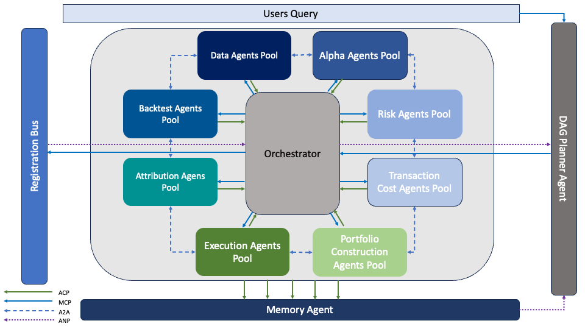

## 📐 System Overview

The system is structured as a vertically layered, protocol-oriented architecture for orchestrating autonomous agent behaviors in algorithmic trading environments. It supports real-time, adaptive decision-making by dynamically composing agents through task-specific execution graphs.

At the entry point, high-level strategic queries are issued via the **Users Query** interface. These are interpreted by the **DAG Planner Agent**, which constructs a directed acyclic graph (DAG) to encode task flow. The **Orchestrator** executes the DAG, coordinating communication and execution across agent pools.

The architecture includes the following specialized **Agent Pools**:

- **Data Agents Pool**: Acquires and preprocesses real-time or historical financial data
- **Alpha Agents Pool**: Generates predictive signals and quantitative factors
- **Risk Agents Pool**: Models portfolio exposure and applies constraints
- **Transaction Cost Agents Pool**: Estimates slippage and market impact
- **Portfolio Construction Agents Pool**: Allocates positions using alpha, risk, and cost inputs
- **Execution Agents Pool**: Routes and executes orders in external markets
- **Attribution Agents Pool**: Analyzes post-trade performance and contribution
- **Backtest Agents Pool**: Evaluates DAG performance over historical market data

All agent pools communicate with a centralized **Memory Agent**, which logs execution traces, model outputs, and evaluation results to support continual learning. Agent registration and health status are maintained by the **Registration Bus**.

The system uses four protocol layers to govern communication:

- **MCP** (Multi-agent Control Protocol): for task scheduling and DAG execution
- **ACP** (Agent Communication Protocol): for result reporting and synchronization
- **A2A** (Agent-to-Agent Protocol): for direct communication between dependent agents
- **ANP** (Agent Notification Protocol): for asynchronous, event-driven system alerts

The complete system design is illustrated below:

This framework enables composable, interpretable, and learning-augmented multi-agent orchestration, offering a flexible foundation for intelligent trading strategy research and deployment.

---

## 🔗 Communication Protocols

Four primary inter-agent communication protocols govern system operations:

| Protocol | Role |
|----------|------|
| `MCP` (Multi-agent Control Protocol) | Task scheduling and lifecycle control |
| `ACP` (Agent Communication Protocol) | Agent feedback and status reporting |
| `A2A` (Agent-to-Agent Protocol) | Peer-to-peer DAG-executed subtask coordination |
| `ANP` (Agent Notification Protocol) | Event-driven alerts and system-wide state propagation |

---

## 📁 Project Structure
├── docs/                 Documentation and Sphinx sources \
├── orchestration/        DAG Controller, Orchestration engine, Bus, Protocols \
├── agents/               Modular agent pools (Alpha, Risk, Execution, etc.) \
├── memory/               Memory Agent and DRL policy learner \
├── config/               YAML-based system configuration \
├── examples/             Strategy simulation and demo DAG runs \
├── tests/                Unit and integration testing modules \
├── Papers/               Whitepapers and system documentation \
├── README.md             Project overview and guide \
├── requirements.txt      Python dependency list \
└── readthedocs.yml       Build configuration for ReadTheDocs 

---

## 🧪 Use Cases

- **Research-grade multi-agent trading experiments**  
- **Live or simulated trading strategy orchestration**
- **Benchmarking RL-based DAG optimizers in financial pipelines**
- **Self-adaptive strategy composition under varying market dynamics**

---

## 📚 Documentation

Complete documentation is available in the [`docs/`](docs/) directory and online at:

📘 https://finagent-orchestration.readthedocs.io

---

## 📝 Citation

If you use this system or build upon it, please cite:
